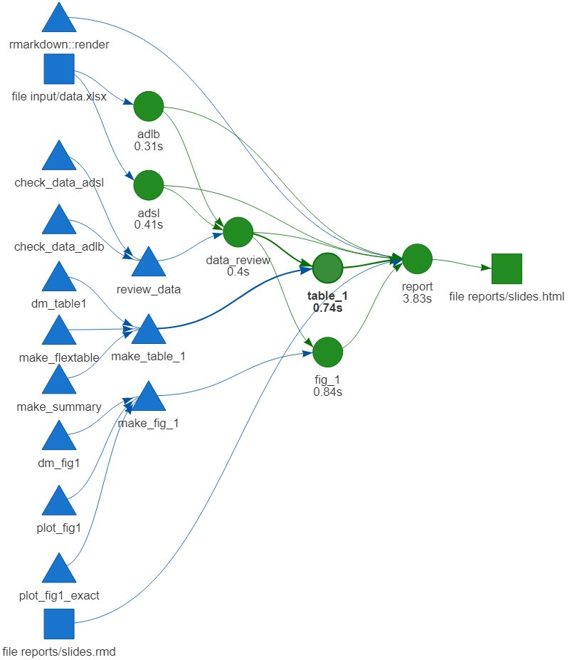

```{r setup, include=FALSE}
knitr::opts_chunk$set(echo = FALSE)
knitr::opts_knit$set(root.dir = rprojroot::find_rstudio_root_file())
options(knitr.table.format = "html")
library(drake)
library(kableExtra)
loadd(table_1)
loadd(adlb)
loadd(adsl)
loadd(fig_1)
loadd(data_review)
```


## Overview of workflow

Workflow  

- Load data
- Clean/Reshape/manage data
- Format outputs (Table 1 & Figure 1)  

<br><br>    

Extra  

- Code available at: [https://github.com/matthew-phelps/novo-ssp.git](https://github.com/matthew-phelps/novo-ssp.git)
- {drake} package for workflow management

## Overview of workflow




## Load data
```{r, echo = TRUE, eval=FALSE}
adsl = read_excel(file_in("input/data.xlsx"), sheet = "ADSL") %>% setDT(),
adlb = read_excel(file_in("input/data.xlsx"), sheet = "ADLB") %>% setDT(), 
```

`file_in()` listens for changes in input data file

## Check data

Check both datasets for missing values and unit convertions

ADSL:
```{r, echo = TRUE, eval=FALSE}
adsl <- add_any_miss(adsl, missing = T, complete = F) %>% setDT()
missing <- adsl[any_miss_all == T]
adsl[, map(.SD, hist), .SDcols = range_vars]
out_range <-
  adsl[any_miss_all == F, map(.SD, range), .SDcols = range_vars]
out_unique <-
  adsl[any_miss_all == F, map(.SD, unique), .SDcols = unique_vars]

```

ADLB:
```{r, echo = TRUE, eval=FALSE}
adlb$ANL01REA <- NULL
  adlb <- add_any_miss(adlb, missing = T, complete = F) %>% setDT()
  missing <- adlb[any_miss_all == T]
  plots <- map(unique(adlb$PARAM), function(i){
    gghistogram(adlb[PARAM==i, AVAL],title = i)
  })
  out_range<- adlb[, range(AVAL), by = PARAM]
```


## Check data

### ADSL results
Observations with missing values:
```{r, echo = FALSE}
knitr::kable(data_review$first_check_adsl$any_missing[,any_miss_all:=NULL]) %>% 
  kable_styling(font_size = 22)
```

Range of values:
```{r, echo = FALSE,results='asis'}
knitr::kable(data_review$first_check_adsl$range)%>% 
  kable_styling(font_size = 22)
```

Check units:
```{r, echo = FALSE,results='asis'}
knitr::kable(data_review$first_check_adsl$unique)%>% 
  kable_styling(font_size = 22)
```


## Data management: Table 1

1. Filter lab dataset to desired observations

```{r, echo = TRUE}

adlb <- adlb[VISITNUM == 10 & PARAMCD == "C64849B" & FASFL == "Y"]
```

2. Check for duplicated subjects
```{r, echo = TRUE}
dub <- adlb[duplicated(SUBJID)]$SUBJID
adlb[SUBJID == dub][,.(SUBJID, TRTP, AVAL, ANL01FL, ANL01REA)]
```

3. After review, remove flagged observation  
```{r, echo = TRUE, eval= FALSE}
adlb[ANL01FL == "N"]
adlb <- adlb[ANL01FL == "Y"]

```


## Data management: Table 1

4. Merge lab and subject level datasets and check for missing observations
```{r, echo = TRUE, eval=FALSE}
dat <- merge(adlb, adsl, all = TRUE, by = "SUBJID", suffixes = c("_adlb", "_adsl"))

```

5. Check for subjects who are in ADSL, but not in ADLB,
and subjects who are in ADLB, but not in ADSL
```{r, echo = TRUE, eval=FALSE}
not_in_adlb <- adsl[FASFL == "Y"][!SUBJID %in% adlb$SUBJID] %>% nrow()
not_in_adsl <- adlb[!SUBJID %in% adsl$SUBJID] %>% nrow()
```


6. Check for discrepancies in the FASFL values between datasets
```{r, echo = TRUE, eval=FALSE}
subject_vec <- dat[FASFL_adlb==FASFL_adsl]$SUBJID
  dat[!SUBJID %in% subject_vec]
```


## Data cleaning review: Table 1


 - Subjects not in ADSL data: `r table_1$missing$not_in_adsl`
 - Subjects not in ADLB data: `r table_1$missing$not_in_adlb`
 - No discrepancies in FASFL values
 
 <br>  
 
### Assumptions:

  - Treatment group is based on `TRT01P` variable.
  - Observations with missing Planned treatment period `TRT01P` (N = 2) <br>
  are assigned value from TRTP variable.
  - Observation with Analysis Record Flag 01 `ANL01FL`== "N" are removed from the analysis (N=1).
  - Observation with height of 181m is typo, changed to 1.81m.

## Making table 1

1. Calculate summary statistics by grouping variable (TRT01P)
```{r, echo=T, eval=FALSE}

tab_summary <- dat[!is.na(get(var)), .(
  n = .N,
  med = formatC(median(get(var), na.rm = T),
                digits = dig,
                format = "f"),
  mean = round(mean(get(var), na.rm = T), digits = dig),
  sd = round(sd(get(var), na.rm = T), digits = dig),
  min = formatC(
    round(min(get(var), na.rm = T), digits = dig2),
    digits = dig2,
    format = "f"
  ),
  max = formatC(
    round(max(get(var), na.rm = T), digits = dig2),
    digits = dig2,
    format = "f"
  )
), by = TRT01P] %>%
  .[order(TRT01P)] %>%
  t()
```


2. Reshape and format results so it can latter be fed into {flextable}
```{r, echo=T, eval=FALSE}
  out <- data.table(
    N = c(tab_summary["n", ], tot["n", ]),
    "Mean (SD)" = c(paste0(tab_summary['mean', ]," (", tab_summary["sd", ], ")"),
                    paste0(tot['mean', ], " (", tot["sd", ], ")")),
    Median = c(tab_summary["med", ], tot["med", ]),
    "Min ; Max" = c(paste0(tab_summary['min', ], " ; ", tab_summary["max", ]),
                    paste0(tot['min', ], " ; ", tot["max", ]))
  )
  m <- out %>% t() %>% as.data.frame() %>% setDT()
  m[, value := names(out)]
  setcolorder(m, "value")
```
3. Do this for each variable of interest
```{r, echo=T, eval=FALSE}
    pmap(list(ls$var, ls$dig, ls$dig2, ls$label), function(a, b, c, d) {
      make_summary(
        dat$dat,
        var = a,
        dig = b,
        dig2 = c,
        label = d
      )
    })
```

## Table 1
```{r, echo = FALSE,fig.align='left'}
table_1$table
```


## Data management - Figure 1

1. Filter to selected observations
```{r echo=TRUE, eval=FALSE}
x <- adlb[PARAMCD == "C64849B" & FASFL == "Y"]
x <- x[ANL01FL == "Y"]
```


2. Extract week number
```{r echo=TRUE, eval=FALSE}
  x[, week_numb := strsplit(x$AVISIT, "\\(Week |\\)") %>% sapply("[", 2)]
  x[, week_numb := as.integer(week_numb)]
```  

3. Mean by treatment group (`TRTP`)
```{r echo=TRUE, eval=FALSE}
  x[, mean := mean(AVAL), by = .(AVISIT, TRTP)]
  dat_plot <- x[, .SD[1], by = .(TRTP, AVISIT)]
```  

## Making Figure 1

1. Create Y-axis ticks that start on a even decimal and cover the data range
```{r echo=TRUE, eval=FALSE}
  y_min <- floor(plot_range[1]*10)/10
  y_min <- y_min-(y_min)%%.2

  y_max <- ceiling(plot_range[2]*10)/10
  y_max <- y_max+(y_max)%%.2
```

2. Make the ggplot
```{r echo=TRUE, eval=FALSE}
plot <- ggplot(dat_plot) +
    geom_line(aes(
      x = week_numb,
      y = mean,
      group = TRTP,
      color = TRTP
    ), size=1) +
    geom_point(aes(
      x = week_numb,
      y = mean,
      group = TRTP,
      color = TRTP
    ), size=3)+
    geom_hline(yintercept = 7, color="black")+
    geom_hline(yintercept = 6.5, color="black")+
    geom_vline(xintercept = 0, color="black")
```

## Making Figure 1

3. Formatting plot
```{r echo=TRUE, eval=FALSE}
plot+theme_bw()+
    labs(caption = "Figure 1 - Mean plot of HbA1c by time - full analysis set")+
    xlab("Week")+
    theme(panel.grid = element_blank(),
          plot.caption = element_text(hjust = 0,
                                      size = 14))+
    scale_color_manual(name="Treatment group", values = c("#E69F00", "#56B4E9"))+
    scale_y_continuous(name="HbA1c (%)",limits = c(y_min, y_max), breaks = seq(y_min, y_max, by=0.2))
```

## Figure 1
```{r echo=FALSE}
fig_1$plot_pretty
```

## Supp - Figure 1 exact

```{r echo=FALSE}
fig_1$plot_exact
```

## Supp - flextable

Construct the flextable object
```{r echo=TRUE, eval=FALSE}
make_flextable <- function(flex) {
  n_col <- ncol(flex)
  n_row <- nrow(flex)
  
  align_seq <- c(1, seq(3, n_row, by = 5))
  flextable(flex)  %>%
    merge_h_range(i = 1,
                  j1 = 1,
                  j2 = 2) %>%
    merge_h_range(i = seq(2, 22, by = 5),
                  j1 = 1,
                  j2 = n_col) %>%
    merge_h_range(i = align_seq,
                  j1 = 3,
                  j2 = 4) %>%
    merge_h_range(i = align_seq,
                  j1 = 5,
                  j2 = 6) %>%
    merge_h_range(i = align_seq,
                  j1 = 7,
                  j2 = 8) %>%
    width(j = 1, width = 0.2) %>%
    width(j = 2:2, width = 2) %>%
    width(j = 3:n_col, width = 1) %>%
    width(j = seq(3, 7, 2), width = .2) %>%
    set_header_labels(
      label = "",
      value = "",
      a_n = "",
      b_n = "",
      tot_n = "",
      a_z = "Treat A",
      b_z = "Treat B",
      tot_z = "Total"
    ) %>%
    set_caption(
      "Table 1 - Baseline and diabetes characteristics - summary - full analysis set",
      autonum = NULL,
      style = "Table Caption",
      html_escape = TRUE
    ) %>%
    add_footer_lines(
      values = c(
        "N: Number of subjects, SD: Standard Deviation, Min: Minimum,
        Max: Maximum, yrs: Years, m: Meter, kg: Kilogram"
      )
    )
}
```
```

